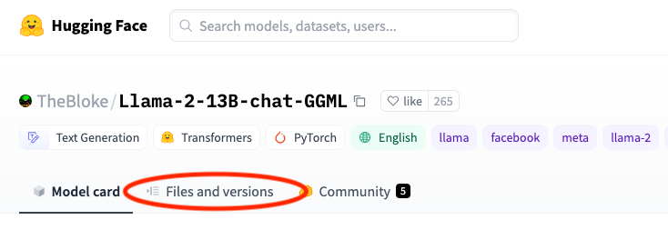
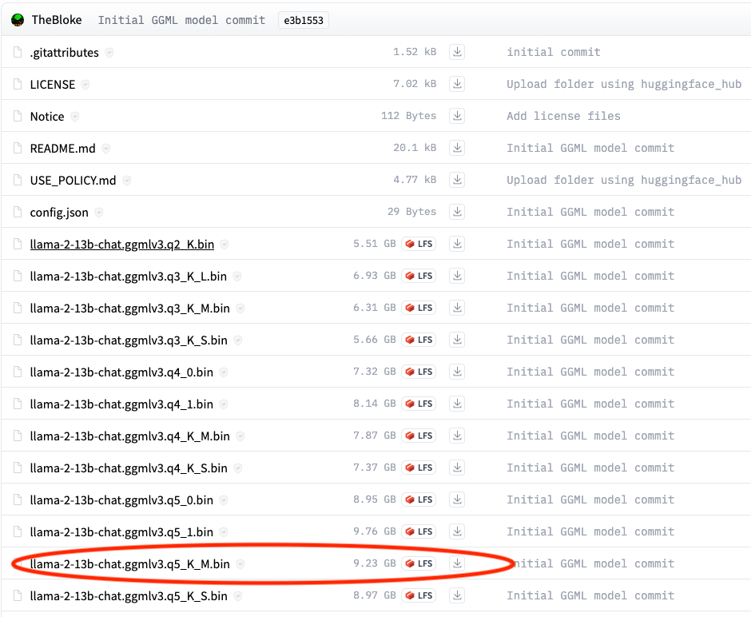
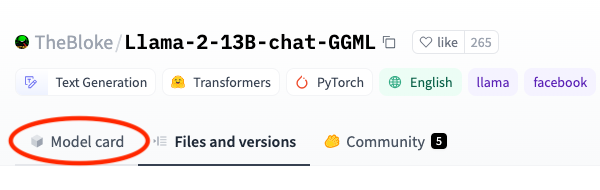

# Introduction

This document gives instructions on how to run a large language model (LLM) using CPU only. Running an LLM on a high end GPU will give faster inference, but not everyone has access to this type of hardware.

The instructions will allow you to run any quantized fine-tuned llama based model in [GGML](https://github.com/rustformers/llm/tree/main/crates/ggml) format. GGML is a binary encoding method that allows for many different quantization levels.

To get the best accuracy / size ratio I'll be using the 5 bit quantized models, but the 4 bit models will give similar (slightly degraded) results.

There are many models to chose from. Since Meta has recently released their Llama 2 model, I'll use this in the instructions.

# LLaMa.cpp

[LLaMa.cpp](https://github.com/ggerganov/llama.cpp) An implementation of the LLaMa inference engine written in C/C++. It supports running models in CPU and on Apple M1/M2 GPUs.

To download and build (requires gcc + make):

```
git clone https://github.com/ggerganov/llama.cpp.git
cd llama.cpp
make
```

# The model

We'll be using a 5 bit quantized [GGML version of the llama 2 chat model](https://huggingface.co/TheBloke/Llama-2-13B-chat-GGML):

Download the `.bin` file by following [this link](https://huggingface.co/TheBloke/Llama-2-13B-chat-GGML)

Then click `Files and versions`



And Download the `llama-2-13b-chat.ggmlv3.q5_K_M.bin` file.



Copy this file into the llama.cpp/models directory

# Running the model

Before running the model, it's important to see if there is a recommended prompt template. Depending on how they model is trained and fine-tuned, you will get more accuarate results by using the recommended prompt template.

Click `model card` on the hugging face model page.



Scroll down until you see the prompt template.

You can modify the template to insert your own questions / instructions

Here is an example of a script I use to test the models.

Download [this scripts][promptLlama2] and modify it as appropriate.

Then, run the scripts:

`./promptLlama2.sh`


[promptLlama2]: promptLlama2.sh